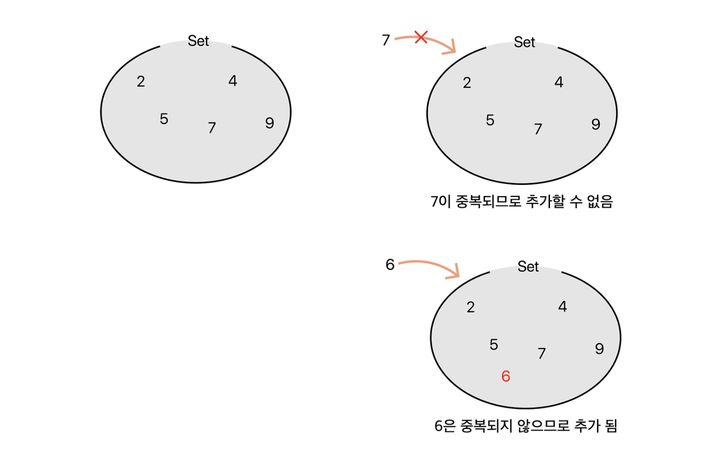

```java
  
import java.util.*;  
  
  
public class MostCommonWord819 {  
   public String mostCommonWord(String paragraph,String[]banned){  
       //금지어를 담을 Set       
       
       Set<String>bannedSet = new HashSet<>(Arrays.asList(banned));  
  
       //빈도수를 계산하기 위한 Map      
        Map<String,Integer>wordCount = new HashMap<>();  
  
       //문장을 소문자로 변환하고, 구두점을 제거한다.  
       String normalizedStr = paragraph.replaceAll("[^a-zA-Z]"," ").toLowerCase();  
  
       //단어를 분리한다.  
       String [] words = normalizedStr.split("\\s+");  
  
       for(String word: words){  
           if(!bannedSet.contains(word)){  
               wordCount.put(word, wordCount.getOrDefault(word,0)+1);  
           }  
       }  
       //가장 빈번한 단어를 찾는다.  
       String mostCommon = "";  
       int maxCount = 0;  
       for(Map.Entry<String,Integer>entry:wordCount.entrySet()){  
           if(entry.getValue() > maxCount){  
               mostCommon = entry.getKey();  
               maxCount = entry.getValue();  
           }  
       }  
       return mostCommon;  
   }  
  
//    public String mostCommonWord(String paragraph, String[] banned) {  
//        // 금지어를 담을 배열  
//        // 가장 빈출된 단어를 담을 배열  
//  
//        List<String>hit = new arrayList<>();  
//        List<String>frequent = new arrayList<>();  
//  
//  
//        for(String x:  paragraph.tokenizer(" ")){  
//            if(banned[0].equals(x)){  
//                hit.add(x);  
//            }  
//            else frequent.add(x);  
//  
//        }  
//        for(int i = 0; i < frequent.length; i++){  
//            String word = frequent[i];  
//            if(word.equals(frequent[i]++)){  
//                cnt++;  
//            }  
//        }  
//        return word;  
//    }  
}

```

`
# 1. 금지어를 담을 Set

```java
Set<String> bannedSet = new HashSet<>(Arrays.asList(banned));
```

## Set이란?

`Set`은 Java의 컬렉션 프레임워크에 속하는 인터페이스로, **중복을  혀용하지않고, 순서가 없다는 특성** 을 가지고 있다.

주요 구현체로는 `HashSet` ,`LinkedHashSet`,`TreeSet`등이 있다.




###  HashSet
이번 구현에도 사용하다시피 가장 기본적인 Set컬렉션의 클래스다.
입력순서를 보장하지 않고, 순서도 마찬가지로 보장되지 않는다.
보통 어디서 사용하나면 게임에서 '닉네임'을 만든다거나 아이디를 생성할때  **'중복확인'** 중복된 닉네임 또는 아이디인지 확인할때 사용한다.
데이터가 정렬되어있을 필요도 없고, 빠르게 중복되는 값인지만 찾으면되는 곳에 사용하면된다.

좀더 상세히 말하자면 hash에 의해 데이터의 위치를 특정시켜 해당 데이터를 빠르게 색인(search)할 수 있게 ㅑㅡ만든것이다.
따라서, HashSet(Hash + Set)은 삽입, 삭제, 색인이 매우 빠르다.

###  LinkedHashSet
LinkedHashSet은 Set의 대표적인 특성 중 하나인 '순서를 보장하지 않는다'를 보완한 형태로 LinkedHashSet(Link + Hash + Set)은  첫번째 요소부터차례대로 출력한다. 즉, **중복은 허용치 않지만, 순서를 보장하고싶을때** 사용한다.

###  TreeSet
TreeSet의 특징은 '가중치에 따른 순서'대로 정렬되어 보장한다. 정리하자면 **중복되지 않으면서 특정 규칙에 의해 정렬된 형태의 집합**을 쓰고싶을때 사용하면 좋다.
특정 구간의 집합요소들을 탐색할때 매우 유용하다.


# 2. 빈도수를 계산하기 위한 Map

Map은 키와 값의 쌍으로 데이터를 저장하는 자료구조이다. 각 키는 고유해야하며, 하나의 키에 하나의 값만 매핑될 수 있다.
`Map`인터페이스의 주요 구현체로는 `HashMap`, `TreeMap`,`LinkedHashMap`등이 있다.
특징은 요소의 저장순서를 유지하지 않는것과 키는 중복을 허용하지 않되, value는 중복을 허용한다.

### HashMap
가장 많이사용되는  `Map`구현체로, 해시 테이블을 기반으로 한다. 키와 값을 쌍으로 묶어 하나의 entry로 저장한다는 특징이 있다. 
- 이진검색 트리는 데이터를 추가하거나 제거하는 등의 기본동작 시간이 매우 빠르다
- TreeMap클래스는 Navigable Map인터페이스를 기존의 이진 검색 트리의 성능을 향상시킨 레드-블랙 트리의 성능을 향상시킨 레드-블랙트리를 기반으로 구현한다.


### TreeMap
키를 자연순서(또는 제공된 `Comparator`)에 의해 정의된 순서로 정렬된 맵을 구현한다. 이진 검색 트리를 기반으로 한다.


### LinkedHashMap
입력 순서 또는 액세스 순서에 따라 키와 값의쌍이 순서대로 저장되는 해시테이블 및 연결리스트의 구현

- put(K key, V value): 지정된 키와 값을 맵에 삽입합니다. 키가 이미 존재하는 경우, 해당 키의 값을 새 값으로 대체합니다.
- get(Object key): 지정된 키에 매핑된 값을 반환합니다. 키가 존재하지 않으면 null을 반환합니다.
- containsKey(Object key): 맵에 지정된 키가 포함되어 있는지 확인합니다. 포함되어 있으면 true, 아니면 false를 반환합니다.
- containsValue(Object value): 맵에 지정된 값이 포함되어 있는지 확인합니다. 포함되어 있으면 true, 아니면 false를 반환합니다.
- remove(Object key): 지정된 키에 매핑된 키-값 쌍을 맵에서 제거합니다.
- size(): 맵에 있는 키-값 쌍의 수를 반환합니다.
- isEmpty(): 맵이 비어 있는지 확인합니다. 비어 있으면 true, 아니면 false를 반환합니다.
- keySet(): 맵에 포함된 모든 키를 반환합니다.
- values(): 맵에 포함된 모든 값을 반환합니다.
- entrySet(): 맵에 포함된 모든 키-값 쌍을 Set 형태로 반환합니다.


